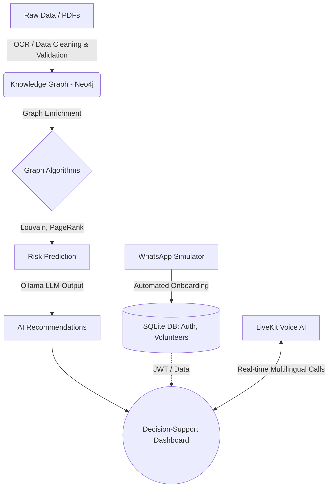

<div align="center">
  
# AAkar
**AI-Powered Booth Civic Intelligence Platform**

[](https://fastapi.tiangolo.com/)
[](https://reactjs.org/)
[](https://neo4j.com/)
[](https://ollama.ai/)
[](https://sqlite.org/)
[](https://nextjs.org/)
[](https://livekit.io/)

Transforming static civic data into a **predictive, booth-level Living Knowledge Graph** with advanced Multilingual Voice AI and automated Volunteer Onboarding.

[Explore Backend Documentation](./backend/README.md) • [Explore Frontend Documentation](./frontend/README.md)

</div>

---

## Overview

**AAkar** is an advanced Civic Intelligence Platform engineered to modernize how local governments and civic leaders understand, predict, and respond to community needs. By aggregating flat datasets regarding voters, localized complaints, and volunteer networks, AAkar constructs a highly interconnected **Knowledge Graph**. 

Moving beyond traditional reactive complaint management, AAkar empowers decision-makers with:

- **Booth-level Risk Prediction**: Anticipate issues before they escalate.
- **Structural Community Detection**: Understand hidden relationships within civic data.
- **Civic Score Computation**: Evaluate community health using dynamically calculated scores based on accurate, real-time node metrics.
- **AI-Based Recommendations**: Receive actionable, localized deployment strategies.
- **Multilingual AI Voice Calls**: Real-time voice interaction system powered by LiveKit.
- **Automated Volunteer Onboarding**: WhatsApp-based interactive bot for seamless volunteer registration with automatic Postal API pincode resolution.
- **Decision-Support Dashboard**: A modern, glassmorphic UI for real-time visualization and natural-language "Ask AI" queries.

---

## Core Architecture

The platform is designed to process, enrich, and visualize raw data at scale, extending to real-time communication protocols.



---

## AI & Data Pipeline

Our intelligence engine is powered by five main pillars:

### 1. Graph Intelligence (Neo4j)
- **Louvain Clustering**: Identifies structural community groups based on interaction data.
- **PageRank Centrality**: Highlights the most significant nodes (hubs) in civic complaint chains.
- **Cluster Density Detection**: Uncovers highly dense problem areas in real-time.

### 2. Predictive Risk Modeling
- Evaluates booth-level risk scores based on complaint growth rates, resolution delays, and localized sentiment.
- Dynamically assigns risk categories (e.g., Low, Medium, High).

### 3. NLP & Secure Cypher Generation (Ollama)
- Translates natural language questions into highly-optimized, **strictly read-only** Neo4j Cypher queries. 
- Employs self-correcting logic to enforce case-insensitive graph traversals, prevents mutating queries (DELETE/CREATE), and summarizes output into conversational answers.

### 4. Multilingual AI Voice & Automated Outreach
- **LiveKit Voice AI**: Implements real-time, low-latency multilingual voice interactions for automated surveys and support.
- **WhatsApp Volunteer Onboarding**: Conversational AI flow for collecting volunteer metadata (Name, Phone, Aadhar, Address) seamlessly.
- **Campaign Broadcasts**: Automated SMS/WhatsApp bulk messaging and campaign tracking.

### 5. Automated Data Ingestion (OCR)
- Processes raw Voter PDF lists into structured Neo4j nodes using Optical Character Recognition (Tesseract) and high-speed multi-threaded bounding-box extraction.
- Continuously watches for data file updates to automatically re-seed the graph.

---

## Project Structure

This is a monorepo containing both the FastAPI graphical backend and the React frontend.

```text
AAkar/
 ├── backend/            # FastAPI, Neo4j, SQLite (Auth/Volunteers), LLM integration, Voice AI
 │   ├── app/            # Main application logic (Endpoints, WebRTC, Graph AI)
 │   ├── data/           # Uploaded CSVs, PDF data, JSON stores
 │   ├── scripts/        # Database seeding & utility scripts
 │   ├── tests/          # Robust backend test suite (pytest)
 │   ├── requirements.txt
 │   └── README.md       # Backend-specific instructions
 │
 ├── frontend/           # Next.js App Router Application
 │   ├── src/
 │   │   ├── app/        # Next.js Pages (Dashboard, Election, WhatsApp Simulator)
 │   │   └── components/ # Reusable UI components
 │   ├── package.json
 │   └── README.md       # Frontend-specific instructions
 │
 └── README.md           # You are here
```

---

## Quick Start Guide

You can run the full application by spinning up both the backend and frontend servers independently.

### Step 1: Backend Setup
Make sure you have a running instance of Neo4j, Ollama, system OCR dependencies, and LiveKit (if testing voice features).

```bash
cd backend
python -m venv .venv
source .venv/bin/activate  # On Windows: .venv\Scripts\activate
pip install -r requirements.txt

# Seed the database with Delhi hierarchy, admin users, and volunteers
python scripts/seed_all.py

# Run the API server
uvicorn app.main:app --reload
```

> **Note:** The database file (`backend/data/database.db` or `aakar.db`) is gitignored. Every fresh clone must run `seed_all.py` to create the initial users and hierarchy.

### Default Login Credentials (after seeding)

| Email | Password | Role |
|---|---|---|
| `serveradmin@aakar.gov.in` | `123456` | ELECTION_ADMIN — can create any role |
| `statedelhi@aakar.gov.in` | `123456` | STATE_ADMIN — manages Delhi |
| `delhiadmin@aakar.gov.in` | `123456` | DISTRICT_ADMIN — manages East Delhi |
| `cons1@aakar.gov.in` | `123456` | CONSTITUENCY_MGR — manages Krishna Nagar |
| `defence@aakar.gov.in` | `123456` | MANDAL_MGR — manages Defence Colony mandal |
| `booth.*@aakar.gov.in` | `123456` | BOOTH_PRESIDENT — 240 booth-level users |

### Step 2: Frontend Setup

```bash
cd frontend
npm install

# Start the Next.js development server
npm run dev
```
*For more frontend details, see the [Frontend README](./frontend/README.md).*

---

## Ethical Design & Safety

AAkar strictly enforces data privacy and ethical AI usage:

- **No Personal Profiling**: Data is anonymized and strictly aggregated at the booth or ward level.
- **No Mutating AI Queries**: The LLM prompt injection barriers are tightly scoped to completely block any commands that attempt to alter or destroy graph data.
- **Secure Local Authentication**: Zero reliance on external cloud services for core logic. Authentication is securely handled natively via a local SQLite database and JWT encryptions.
- **Role-Based Access**: Designed for authorized civic administrators and planners with strict hierarchical visibility.

---

## Built For
Designed to set a new standard in **AI in Governance**. A highly scalable architecture tailored for Smart Cities, Decision Support Systems, Volunteer Mobilization, and Civic Intelligence.
